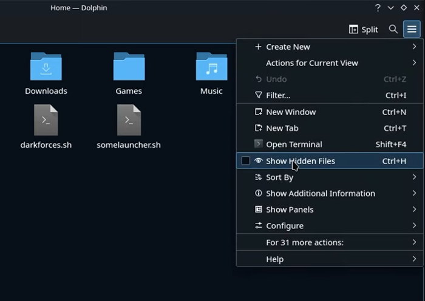
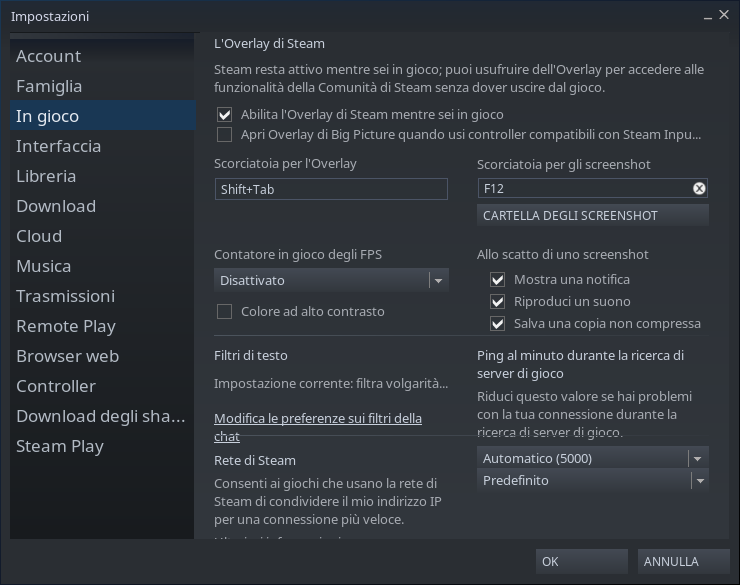

Come immagino saprete, premendo contemporaneamente i tasti **STEAM** ed **R1** è possibile scattare uno screenshots, e questo è visibile all'interno della galleria.

Il problema è che da quella interfaccia l'immagine è possibile solamente caricarla sul proprio profilo Steam e nient'altro.

Cercando in rete ho trovato [in questo video](https://www.youtube.com/watch?v=l_BjlTZUias) due informazioni interessanti:

- la posizione nel file system degli screenshot
- la possibilità di cambiare la sopra citata posizione

### La posizione degli screenshot

In modalità desktop apriamo Dolphin e, prima di tutto, abilitiamo la visualizzazione delle cartelle nascoste premendo il tasto con le tre righe orizzontali in alto a destra e scegliendo "Show hidden files"

A questo punto navigiamo nella cartella _.steam/steam/userdata/{id}/760/remote/_: qui troviamo una cartella per gioco (anche qui nominate con un identificativo) e, all'interno, gli screenshot che abbiamo scattato.

### Cambiare la cartella di salvataggio

Sempre in modalità desktop, clickiamo con il tasto destro del mouse sull'icona di Steam nella barra di sistema, e scegliamo _Settings_: alla voce _In-Game_ c'è il pulsante **Screenshot folder**: da lì possiamo scegliere dove salvare d'ora in avanti i nostri screenshot.

Davide
