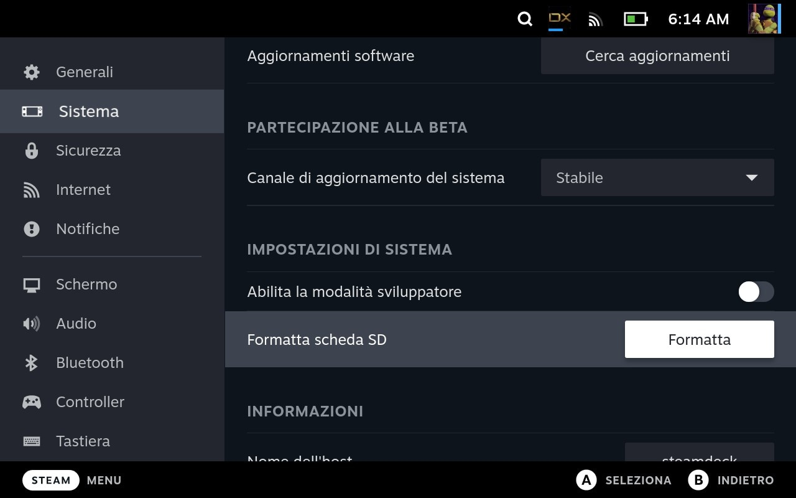

Ho fatto un upgrade della Micro SD che avevo inserito inizialmente nella mia Steam Deck, passando da 64GB a [256GB](https://www.amazon.it/samsung-microsd-memoria-adattatore-mb-mc256ka/dp/b09ffd6r2b).
Ovviamente il mio dubbio più grande era quello di riuscire a spostare giochi e salvataggi (sia dei contenuti scaricati da Steam sia di quelli di Heroic) da una all'altra, ma, come anticipavo, l'operazione è risultata molto semplice.

Passi operativi:

- togliere la micro SD dalla Deck
- inserire la micro SD nuova
- formattare la nuova micro SD
- spostare i contenuti dalla micro SD vecchia a quella nuova

Approfondisco con un paio di parole in più gli ultimi due punti

### Formattare una nuova micro SD

Anche questa operazione non è niente di complesso se si sa dove effettuarla: dalla _Gaming Mode_ ci basta premere sul **tasto Steam** e andando alla voce Sistema e, scollando in fondo alla pagina, troveremo la sezione _Impostazioni di sistema_ con la voce che stiamo cercando.

### Spostare i contenuti

A quanto pare, quello che succede quando si effettua l'operazione precedente, oltre alla cancellazione dei dati contenuti nella micro SD viene creata un'alberatura di cartelle (_/lost+found_, _/steamapps_) e un file dal nome _libraryfolder.vdf_.
Nel mio caso c'era anche un'ulteriore cartella, _heroic_, perchè avevo scelto di installare anche i giochi provenienti da quel launcher sulla micro SD.
Ho collegato alla Deck la vecchia micro SD tramite un adattatore USB, ho copiato tutto il contenuto e l'ho incollato nella nuova destinazione.
Dopo un riavvio (non so se utile o necessario, ma male non fa) ho visto tutti i giochi perfettamente riconsciuti dai rispettivi launcher.

Davide
