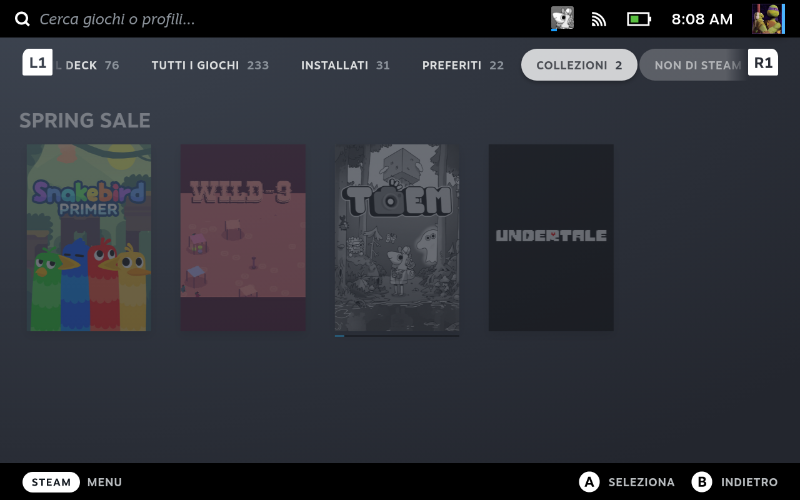

Ho approfittato degli sconti di Steam per recuperare quattro giochi che, per un motivo o per l'altro, erano salvati nella mia wishlist. 
Li segnalo qui, anche solo per dare qualche idea ai lettore.

[Snakebird Primer](https://store.steampowered.com/app/1014140/Snakebird_Primer/) è un puzzle game coloratissimo dalla difficoltà medio-bassa (a differenza di quanto dicono essere il [suo predecessore](https://store.steampowered.com/app/357300/Snakebird/)): i pochi minuti spesi con lui fin'ora mi hanno convinto, i livelli sono brevissimi e _uno tira l'altro_.

[WILD-9](https://store.steampowered.com/app/1567060/WILD9/), invece, al momento mi ha un po' deluso: è un action game dei [Sokpop Collective](https://sokpop.co/), realizzato con un'interessante grafica in sprite stacking, ma mi sta dicendo un po' poco, complice il fatto che non supporta il gamepad e quindi giocarlo su Deck è un po' una tortura.

[TOEM](https://store.steampowered.com/app/1307580/TOEM) mi ha conquistato istantaneamente. E' un gioco in cui il protagonista deve effettuare un viaggio per raggiungere la cima di una montagna, e per spostarsi deve guadagnarsi i biglietti del bus a suon di **buone azioni** da effettuare con una **macchina fotografica** donatagli dalla nonna. E' curatissimo e trasmette davvero _buone vibes_, veramente delizioso. Ho giocato la prima mezz'ora e mi sta dando la sensazione di trovarmi di fronte ad un nuovo [A Short Hike](https://store.steampowered.com/app/1055540/A_Short_Hike/).

[Undertale](https://store.steampowered.com/app/391540/Undertale/) non ha decisamente bisogno di presentazioni: è talmente famoso che persino io, che non l'ho ancora giocato (eh si, mea culpa, ma ora posso recuperare), so di cosa tratta.

Gli sconti non sono ancora finiti, e ci sono un paio di giochi che ancora mi stuzzicano (un [platform 3d vecchia scuola](https://store.steampowered.com/app/1701800/Lunistice) e un [gioco d'azione tripla A di qualche anno fa](https://store.steampowered.com/app/1172380/STAR_WARS_Jedi_Fallen_Order/)), aggornerò eventualmente questo post in caso di novità.

Davide